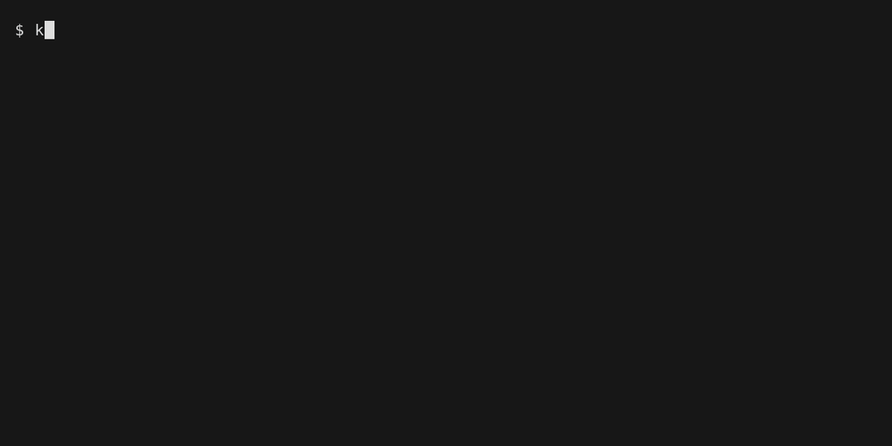

# kak-ansi-rs

Kakoune support for rendering ANSI-colored text — a Rust port of
[kak-ansi](https://github.com/eraserhd/kak-ansi), drop-in compatible:
same option names (`ansi_color_ranges`, `ansi_command_file`, `ansi_filter`),
same commands, same hooks, same `kak-ansi-filter` binary name and protocol.



## Installing

With [kak-bundle](https://codeberg.org/jdugan6240/kak-bundle) or any plugin
manager that sources `rc/*.kak`. The plugin finds the filter binary in this
order:

1. `target/release/kak-ansi-filter` or `kak-ansi-filter` in the plugin dir
2. `kak-ansi-filter` on `$PATH`
3. built on first load with `cargo build --release` if cargo is available

Manual build:

```sh
cargo build --release
```

Requires only the Rust standard library — no dependencies.

## Usage

* **ansi-render** — remove ANSI escapes from the buffer and highlight the
  regions that were colored.
* **ansi-render-selection** — same, for the current selection.
* **ansi-clear** — clear the highlighting.
* **ansi-enable** / **ansi-disable** — toggle automatic rendering of new
  fifo data (done automatically for `*stdin*` buffers, i.e. Kakoune as a
  pager, and for `man` pages).

The filter also collapses nroff/man overstrikes (`X\bX` → bold, `_\bX` →
underline), translates DEC line-drawing characters, deletes CRs, and
swallows OSC sequences (hyperlinks, shell integration) and non-SGR CSI
sequences.

## Differences from the C original

Behavior-parity is the floor — the original bash test suite passes verbatim
against this binary (`tests/run-reference-suite.sh`). Deliberate fixes on
top:

* A lone `ESC` no longer leaves the escape parser armed (the C ate
  characters after a later bare `[` in plain text). Corollary: `ESC`
  followed by `ESC`/`CR`/`SO`/`SI` is re-dispatched instead of printed
  literally, so e.g. `\e\e[31m` still parses as SGR — a byte-for-byte
  comparison against the C binary will differ on exactly these inputs.
* Truecolor components are clamped to 0–255; the C emitted invalid colors
  like `rgb:12C0102` which made Kakoune's `source` fail.
* Input is decoded as UTF-8 regardless of locale; an invalid byte becomes
  U+FFFD instead of silently truncating the rest of the input.
* SGR 9/29 map to Kakoune's `s` (strikethrough) attribute.
* Huge numeric parameters saturate instead of hitting `%d` overflow UB.
* An OSC longer than the buffer cap can still be terminated by `ESC \`
  (the C could only end it with BEL past the cap).
* Error messages are emitted as Kakoune *single-quoted* strings (which are
  fully inert — no `%sh{}`/`%val{}` expansion), so panics and arbitrary argv
  text can never leak executable text into the sourced command file.
* The filter path and the command-file redirect are single-quoted in the
  pipe register, so paths with spaces work.
* `-range` parsing is stricter than the C's `sscanf`: leading whitespace or
  trailing garbage (`1.1,2.2x`) is rejected instead of silently ignored.
* `-range` also rebases the face-run start (the C only rebased the cursor),
  so input ending in an unconsumed SGR — common for fifo chunks that stop
  mid-color — never leaks a range outside the piped selection. The C emitted
  ranges spanning from 1.1 into the buffer before the selection (e.g.
  `x\e[32m` with `-range 8.3,10.2` gave `1.1,8.3|green`, and `\e[32m` alone
  the invalid `1.1,1.0|green`); this port emits nothing in both cases, since
  the trailing SGR styled no characters.
* Output is not streamed: all of stdin is read before anything is written
  (the C emits progressively). Invisible through Kakoune, which consumes
  the output after the process exits, but `tail -f | kak-ansi-filter`
  standalone produces nothing until the pipe closes.

### Known limitation (inherited)

`ansi-render-selection` with **multiple selections** renders text for each
but only keeps correct highlighting for one: the `-range` offset and the
command file are expanded once for the main selection. Use it with a single
selection (as `ansi-render` and the fifo hooks do).

## Tests

```sh
cargo test                       # unit + integration tests
tests/run-reference-suite.sh     # original kak-ansi suite against this binary
```
